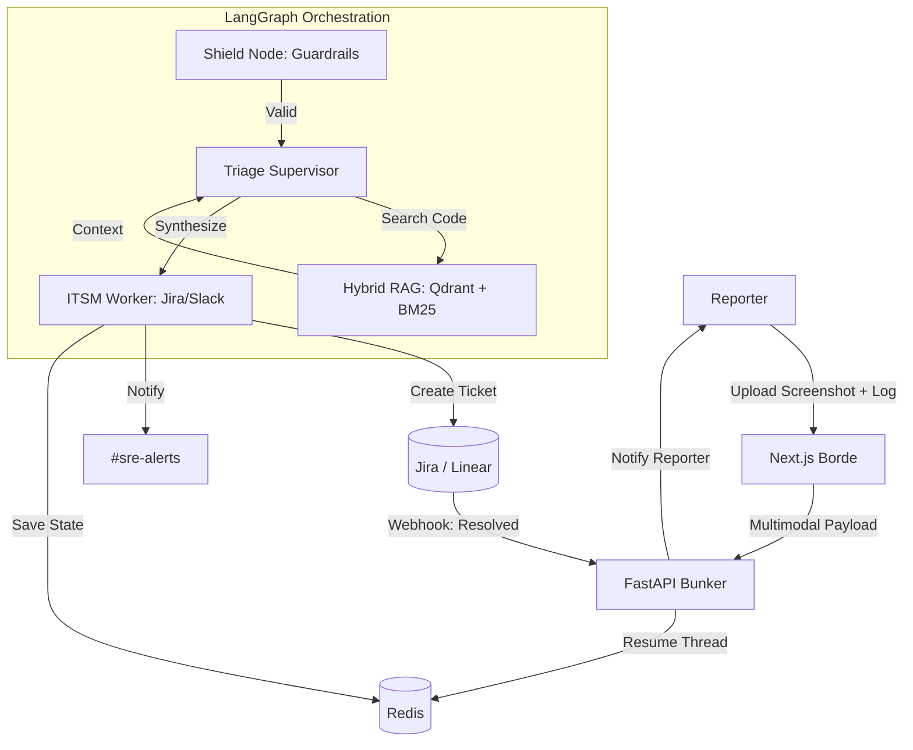

# SPEC-011: README.md

---

# 🛡️ Rubrica: The Autonomous SRE Layer for Saleor

**AgentX Hackathon 2026 Submission** | **Project Rubrica**

Rubrica is a production-ready, stateful SRE Incident Intake & Triage Agent designed specifically for the Saleor e-commerce ecosystem. It bridges the gap between chaotic failure reports and structured technical resolution by combining multimodal intelligence with agentic orchestration.

---

## 🚀 Project Summary

In complex e-commerce environments, identifying the root cause of an incident requires correlating visual UI failures with fragmented server logs and thousands of lines of code. Rubrica acts as "Agentic Middleware":

- **Intakes** multimodal reports (Screenshots + Logs).
- **Triages** using a 2M token context window to "read" the Saleor codebase.
- **Automates** the ticketing lifecycle, including a stateful "Wait-and-Resume" flow that notifies reporters only after a human verifies the fix in Jira.

---

## 🏗️ Architecture Overview: The Bunker & The Borde

Rubrica is built on a **Decoupled Monorepo** architecture to ensure scalability and reliability.

### 1. The Bunker (Backend)

The engine of Rubrica. A FastAPI service running a LangGraph state machine.

| Component | Technology |
|-----------|------------|
| **Intelligence** | Gemini 1.5 Pro (Triage) & Gemini 1.5 Flash (Security) |
| **Persistence** | Redis for stateful checkpointing, allowing the agent to "hibernate" while waiting for external webhooks |
| **Memory** | Qdrant for Hybrid RAG (Vector + Keyword) across the Saleor repository |

### 2. The Borde (Frontend)

A high-performance Next.js 14 application designed for zero-friction incident reporting.

| Aspect | Details |
|--------|---------|
| **UX** | Tailored for SREs with real-time status updates and multimodal file upload support |
| **Communication** | Typed API client synchronized via shared Pydantic schemas |

---

## 🔄 The Workflow Diagram



---

## 🛠️ Setup Instructions

To run Rubrica locally or in the cloud, follow these steps.

### Prerequisites
- Docker & Docker Compose
- Google Gemini API Key
- (Optional) OpenRouter API Key
- (Optional) LangSmith & Opik API Keys for observability

### Quickstart (The "2-Minute" Build)

**1. Clone the repository:**
```bash
git clone https://github.com/your-username/rubrica.git
cd rubrica
```

**2. Configure Environment:**
```bash
cp .env.example .env
# Open .env and add your GEMINI_API_KEY
```

**3. Launch the Stack:**
```bash
docker compose up --build
```

**4. Access the Application:**
- **Frontend (Borde):** http://localhost:3000
- **Backend API (Bunker):** http://localhost:8000
- **API Docs:** http://localhost:8000/docs

---

## 📊 Tech Stack & Integrations

| Layer | Technology |
|-------|------------|
| **LLMs** | Google Gemini 1.5 Pro & Flash |
| **Orchestration** | LangGraph (Stateful DAG) |
| **Backend** | FastAPI (Python 3.12) |
| **Frontend** | Next.js 14, Tailwind CSS, shadcn/ui |
| **Database** | Qdrant (Vector), Redis (State) |
| **Observability** | LangSmith, Opik, Loguru |
| **Integrations** | Jira Cloud, Slack, SendGrid/Email |

---

## 📄 License

This project is open-sourced under the MIT License. See the LICENSE file for details.
